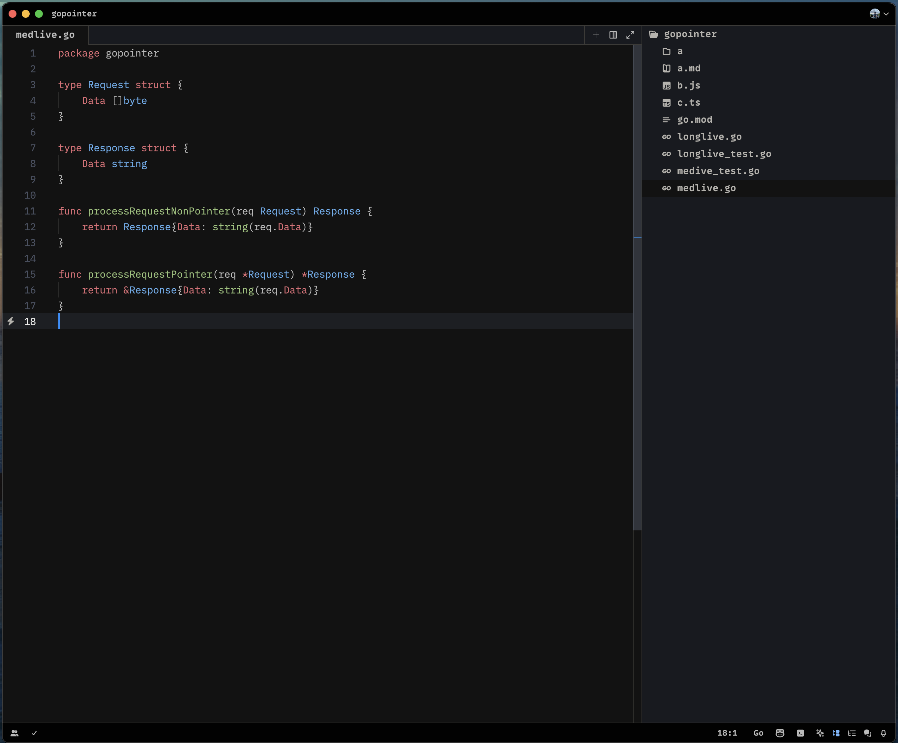
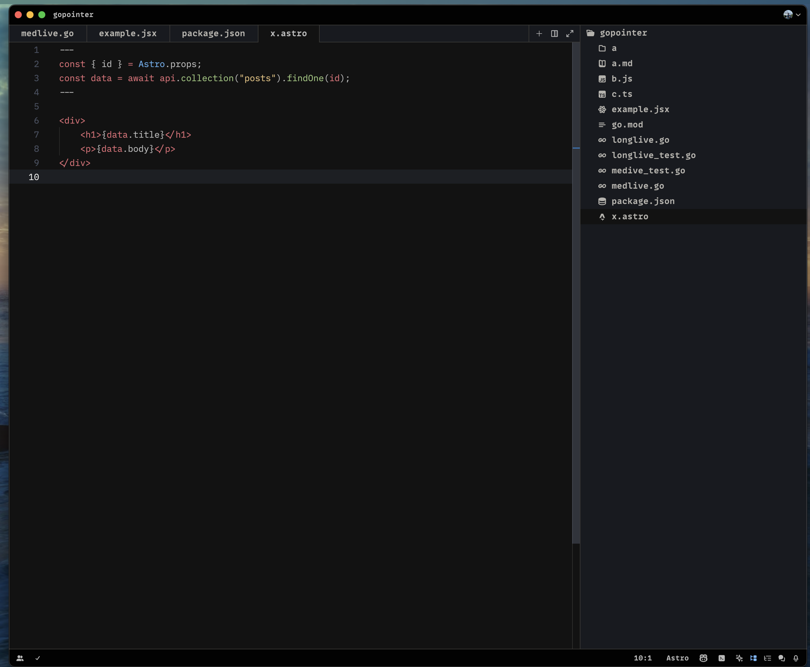
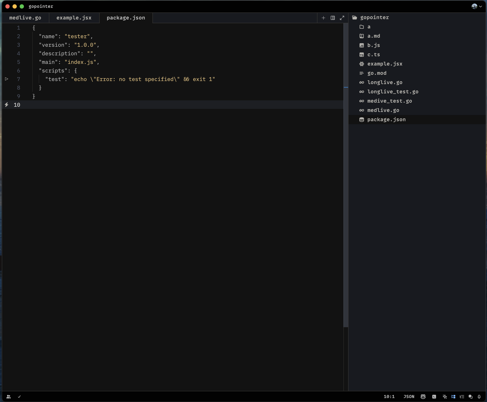
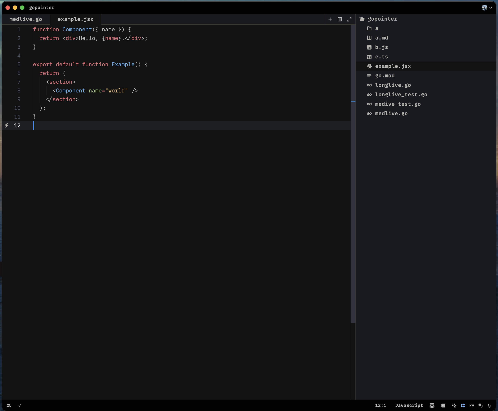

# [One Dark Pro Monokai Darker](https://github.com/9ssi7/zed-one-dark-pro-monokai-darker)

This project copied from @eser's vscode-one-dark-pro-monokai-darker project. I just integrated to Zed IDE.

[Go to original project](https://github.com/eser/vscode-one-dark-pro-monokai-darker)

A darker variation of One Dark Pro theme for Zed, with Monokai code coloring.

## Screenshots

## Requirements

* Zed 0.14.0 or later

## License

Apache 2.0, for further details, please see [LICENSE](LICENSE) file
